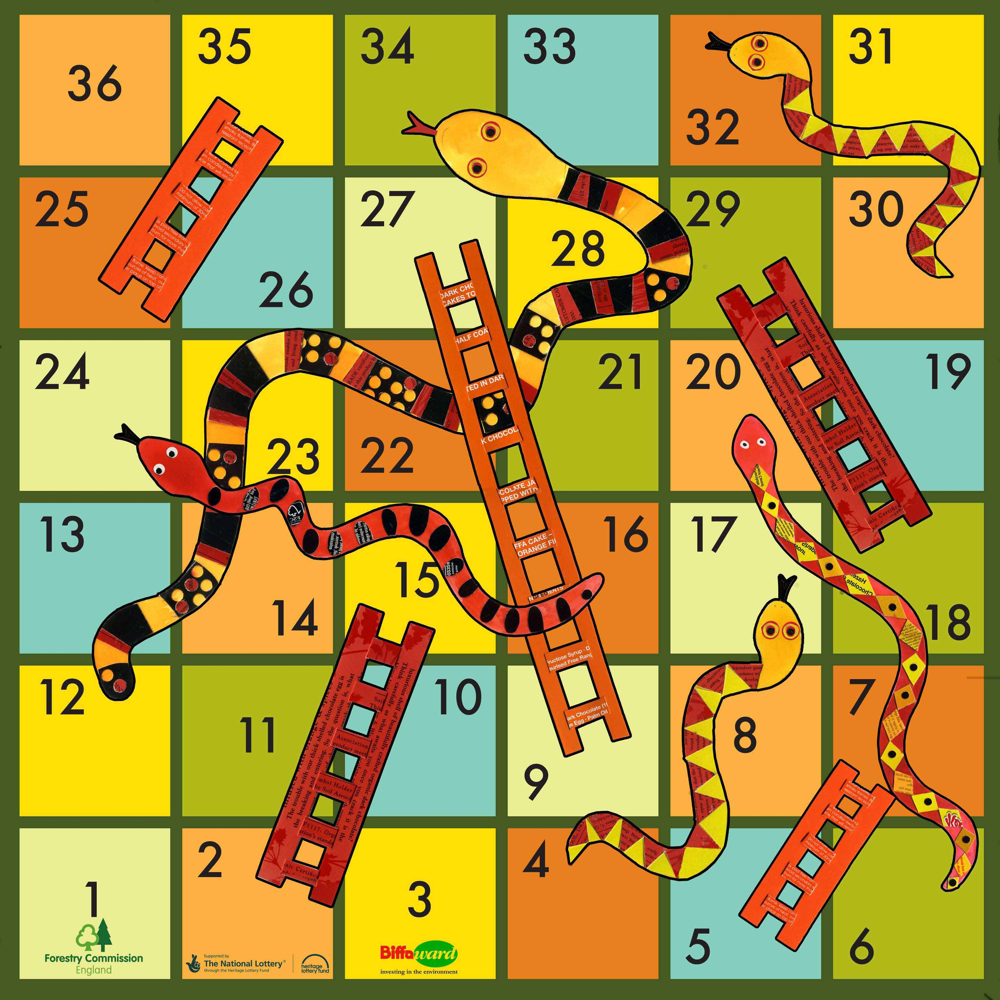
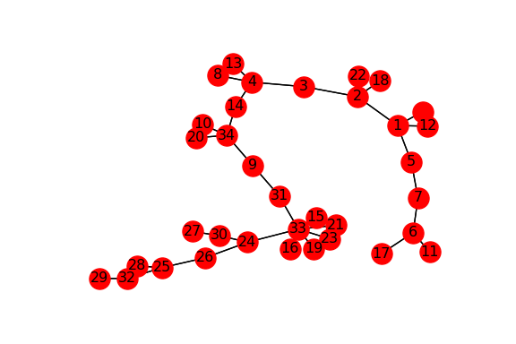
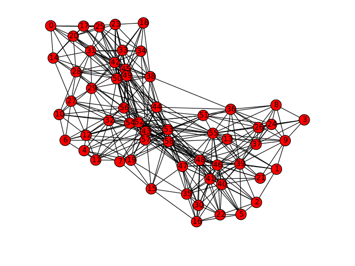

Teoria dos Grafos - Professor Alexandre Levada - Universidade Federal de São Carlos - UFSCar

Alunos:

Bianca Garcia Martins RA:606723

Gabriel Tanasovici Nardy RA:726521

Samara M. M. S. Almeida RA:592790

Objetivo:

O trabalho proposto nesta disciplina teve como objetivo aprender Teoria dos Grafos na prática, utilizando a linguagem Python.

Serão apresentados os problemas, suas soluções, e pequenas introduções importantes para a sua execução. Para mais detalhes sobre teorias acesse a apostila do professor:
https://github.com/bigarcia/trab-grafos/blob/master/Notas_de_Aula_TG.pdf

Introdução:

Um grafo é composto por dois conjuntos não vazios, um de vértices (V) e outro de arestas (E). Uma aresta esta associada a dois vértices (extremidades da aresta), seguindo a relação binária E Vx V.
Um grafo não direcionado é aquele que as arestas (a,b) são iguais as arestas (b,a), onde a e b são vértices. Em contrapartida, em um gráfico direcionado  a seguinte relação é válida <a,b><b,a>.

PROJETO 1: SNAKES AND LADDERS

Problema:

O problema é baseado no jogo Snakes and Ladders.
Snakes and Ladders é um famoso jogo de tabuleiro em que a cada rodada um jogador joga uma moeda não viciada e avança 1 casa se obtiver cara ou avança 2 casas se obtiver coroa. Se o jogador para no pé da escada, então ele imediatamente sobe para o topo da escada. Se o jogador cai na boca de um cobra então ele imediatamente escorrega para o rabo. O jogador sempre inicia no quadrado de número 1. O jogo termina quando ele atinge o quadrado de número 36.

O objetivo é :

a)
Gerar o diagrama de estados da cadeia de Markov que representa o jogo, computando para isso a matriz de transição de estados P

b)
1.Desenvolver um script em Python para calcular a distribuição estacionária da cadeia de Markov homogênea em questão
2.Encontrar  a probabilidade de um jogador vencer o jogo, ou seja, a probabilidade de se atingir o estado 36 no longo prazo.
3.Para k = 100 um número suficiente de iterações no Power Method, encontrar os estados mais prováveis de serem acessados.

c)
Especificara matriz P_ (P_barra) referente ao modelo Pagerank considerando alpha = 0.1. 
Para k = 100, aplicar o Power method e comparar o resultado com o obtido no item b). 
Determinar se as distribuições estacionárias obtidas em b) e c) são iguais ou diferentes.

Introdução

Antes de resolver o exercício é interessante relembrar o  de Cadeia de Markov:

A cadeia de markov é um processo estocástico caracterizado por seu estado futuro depender apenas do seu estado atual, sendo que os estados passados não influenciam no estado futuro. 

Resolução:

A imagem que representa a cadeia de Markov é gerada na pasta do projeto com o nome Markov.pgn, como pode ser observado abaixo. Caso haja interesse em verificar cada vértice e suas arestas existentes no grafo, basta acessar vestices_arestas.txt na pasta do projeto.

A matriz de probabilidades é gerada no arquivo matrix.txt presente na pasta do projeto.

PROJETO 2: ÁRVORE GERADORA MÍNIMA
A partir de um dataset específico (grafo ponderado armazenado em ha30_dist.txt  e ha30_name.txt) implementar o algoritmo de Prim para extrair uma Minimum Spanning Tree (MST) de G.

 
Introdução:
MST é uma Árvore Geradora Mínima (Minimum Spanning Trees). Uma árvore geradora representa uma forma resumida de representar um grafo, pois há um e apenas um caminho entre qualquer par de vértices. A árvore geradora mínima é aquela que possui menor peso.

Resolução:

Para ler e transformar a matriz de adjacências em um grafo utilizou -se as seguintes linhas de código:
import numpy as np
import networkx as nx
A = np.loadtxt('matriz.txt')
G = nx.from_numpy_matrix(A)
Primeiro se imprimi o grafo original:

Depois gera-se o MST resultante:

PROJETO 3: BUSCA EM LARGURA E PROFUNDIDADE

O objetivo é Implementar os algoritmos BFS (Breadth- First Search, ou também conhecido como Busca em Largura) e DFS (Depth-First Search, ou também conhecido como Busca em Profundidade)  para extrair as árvores BFS-tree e DFS-tree dos grafos a seguir.

Introdução:

Um algoritmo de busca é um algoritmo que percorre um grafo andando pelas arestas de um vértice a outro, examinando estes sistematicamente. Ele parte de um vértice inicial (raiz) e percorre todos as outras arestas e seus vértices até alcançar um vértice final, sendo que cada aresta é examinado no máximo uma vez.

No BFS a cada novo nível descoberto, todos os vértices daquele nível devem ser visitados antes de prosseguir para o próximo nível.
No DFS  a cada vértice descoberto, explora - se um de seus vizinhos não visitados ( sempre que possível). Imita exploração de labirinto, aprofundando sempre que possível.

Solução:

O primeiro grafo, nomeado de Karate (como mostrado abaixo), é encontrado na pasta do projeto com o nome Karate_Before.pgn e foi construído importando o documento karate.paj, que contém todos os vértices e arestas do grafo.

Após a implementação do BFS no grafo original, a seguinte imagem do grafo é gerado na pasta do projeto, com nome BFS_Karate_After.png.

Todos os passos de execução do BFS são apresentado no BFS_Karate.txt, que se encontra na página do projeto

Após a implementação do DFS no grafo original, a seguinte imagem do grafo é gerado na pasta do projeto, com nome DFS_Karate_After.png

O primeiro grafo, nomeado de Dolphins (como mostrado abaixo), é encontrado na pasta do projeto com o nome Dolphins_Before.pgn e foi construído importando o documento karate.paj, que contém todos os vértices e arestas do grafo.

Após a implementação do BFS no grafo original, a seguinte imagem do grafo é gerado na pasta do projeto, com nome BFS_Karate_After.png.

Todos os passos de execução do BFS são apresentado no BFS_Karate.txt, que se encontra na página do projeto

Após a implementação do DFS no grafo original, a seguinte imagem do grafo é gerado na pasta do projeto, com nome DFS_Karate_After.png

PROJETO 4: ÁRVORES DE CAMINHOS MÍNIMOS E AGRUPAMENTO DE DADOS
A partir de um dataset específico (grafo ponderado armazenado em wg59_dist.txt, wg59_main.txt, wg59_name.txt) e implementar o algoritmo de Dijkstra para extrair uma árvore de caminhos mínimos de G.

Metodologia

Após a implementação do algoritmo, uma forma de crescer várias subárvores de caminhos mínimos é inicializar várias sources, ou seja, atribuir custo inicial zero a um número K de vértices. O restante do algoritmo permanece intacto. O que irá acontecer é um processo de disputa entre cada uma das raízes para verificar qual delas irá conquistar cada vértice de G. Ao final da execução um vértice estará "pendurado" apenas a uma única subárvore, fazendo com que tenhamos vários grupos de nós, similar ao que acontecia com as MST's. Porém aqui há supervisão no processo de formação dos grupos, uma vez que o usuário pode definir de onde as subárvores irão iniciar o crescimento (esses pontos devem ser escolhidos de forma a definir o centro dos agrupamentos).

QUESTIONAMENTOS

Considerando o grafo em questão, mostre os resultados (plote graficamente) obtidos para:
a) 2 agrupamentos (K = 2) 
b) 3 agrupamentos (K = 3)

Solução:
Primeiramente imprimiu o gráfico inicial, como pode se ver abaixo:

Depois foram gerado os seguinte grafos:

PROJETO 5: OPÇÃO A: O PROBLEMA DO CAIXEIRO VIAJANTE

Desenvolver um programa que deve ler um grafo Hamiltoniano ponderado a partir de um arquivo qualquer e através de um algoritmo visto em sala (2-otimal ou Twice-Around) obter 10 soluções diferentes para o problema do caixeiro-viajante.

1.METODOLOGIA

Para obter soluções distintas para o problema há algumas heurísticas comumente adotadas na prática: utilizar diferentes inicializações, ou seja, soluções iniciais. Elas podem ser geradas simplesmente aleatoriamente (selecionando vértices quaisquer) ou utilizando alguma heurística, como por exemplo a escolha do vizinho mais próximo por exemplo. Dessa forma, escolhe-se aleatoriamente apenas o primeiro vértice do ciclo (v0) e depois sempre é escolhido como próximo elemento da sequência o vizinho mais próximo do vértice atual, até que o ciclo Hamiltoniano seja formado (não sobre mais vértices). 

2.QUESTIONAMENTOS

Liste as 3 melhores soluções e as 3 piores obtidas. Qual a diferença de custo entre a melhor e a pior? Discuta como a diferença pode ser significativa.

Solução:

Escolheu- se o algoritmo de Prim para se obter a MST e Twice-Around como algoritmo para a resolução do caixeiro viajante.

Obteve-se assim 10 soluções diferentes, mostradas abaixo.

